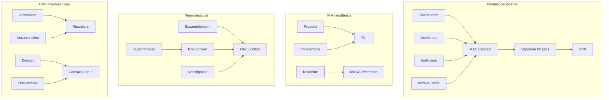

# 🎯 ANZCA/CICM Primary Examination Intelligence Dossier

> **Generated**: 2025-11-27 08:12
> **Data Sources**: SAQ Database (1,609 questions) | VIVA Database (1,851 questions) | Neo4j Graph Analytics

---

## Executive Summary

This dossier synthesizes comprehensive analysis of **ANZCA** and **CICM** Primary Examination patterns across:
- **835** ANZCA SAQ questions (1999-2025)
- **789** CICM SAQ questions (2007-2025)  
- **1,646** ANZCA VIVA questions (2007-2024)
- **205** CICM VIVA questions (2007-2024)

### Key Strategic Insights

| Dimension | ANZCA | CICM | Strategic Implication |
|-----------|-------|------|----------------------|
| **SAQ Focus** | Inhalational agents, equipment | Electrolytes, CVS drugs | College-specific depth required |
| **VIVA Emphasis** | Respiratory (196), Haematology (179) | Less structured domains | VIVA preparation differs significantly |
| **Cross-College Gap** | 16 topics never in CICM | 4 topics never in ANZCA | Migration opportunities for 2026 |

---

## Part I: Cross-College Topic Asymmetry Analysis

### 🔴 ANZCA-Exclusive Topics (Never Asked in CICM SAQs)

These topics have **only** appeared in ANZCA examinations, representing potential "blind spots" for CICM candidates who may cross-train, and indicating ANZCA's distinctive curriculum emphasis.

| Topic | ANZCA Count | Last Appearance | VIVA Frequency | Risk Level |
|-------|-------------|-----------------|----------------|------------|
| **sevoflurane** | 26 | 2025 | 7 | 🟢 LOW |
| **nitrous_oxide** | 9 | 2022 | 19 | 🟡 MEDIUM |
| **desflurane** | 9 | 2022 | 0 | 🟡 MEDIUM |
| **neostigmine** | 8 | 2024 | 5 | 🟢 LOW |
| **isoflurane** | 8 | 2008 | 1 | 🔴 HIGH |
| **thiopentone** | 5 | 2005 | 17 | 🔴 HIGH |
| **TCI** | 5 | 2024 | 1 | 🟢 LOW |
| **vaporiser** | 5 | 2023 | 3 | 🟡 MEDIUM |
| **ropivacaine** | 4 | 2022 | 6 | 🟡 MEDIUM |

> **Interpretation**: ANZCA-exclusive topics reflect the anaesthesia-centric curriculum focusing on volatile agents, intravenous induction agents, and equipment physics that are less emphasized in intensive care training.

### 🔵 CICM-Exclusive Topics (Never Asked in ANZCA SAQs)

| Topic | CICM Count | Last Appearance | Strategic Value |
|-------|------------|-----------------|-----------------|
| **digoxin** | 7 | 2024 | ⭐⭐⭐ |
| **dobutamine** | 4 | 2025 | ⭐⭐ |
| **SVP** | 2 | 2010 | ⭐ |
| **oxygen_cascade** | 2 | 2015 | ⭐ |
| **tranexamic_acid** | 2 | 2021 | ⭐ |

> **Interpretation**: CICM-exclusive topics reflect intensive care's focus on cardiac pharmacology (digoxin), haemostasis (tranexamic acid), and organ support that are less tested in anaesthesia examinations.

---

## Part II: VIVA vs SAQ Assessment Matrix

Understanding the differential testing patterns between written (SAQ) and oral (VIVA) examinations is **critical** for optimized preparation.

### Assessment Format Distribution

```
VIVA-Dominant Topics (Oral Explanation Focus)
├── Saturated Vapour Pressure (SVP): 13 VIVA vs 0-2 SAQ
├── Thiopentone Pharmacology: 19 VIVA vs 5 SAQ  
├── Oxygen Cascade: 8 VIVA vs 2 SAQ
└── Oxytocin/Uterotonics: 8 VIVA vs 2 SAQ

SAQ-Dominant Topics (Written Detail Focus)
├── Desflurane/Sevoflurane: 788/26 SAQ vs 37/7 VIVA
├── MAC Calculations: 280 SAQ vs 57 VIVA
├── Acid-Base Physiology: 21 SAQ vs 8 VIVA
└── Obesity/Bariatrics: 12 SAQ vs 1 VIVA

Balanced High-Yield Topics (Master Both Formats)
├── Pregnancy Physiology: 42 VIVA + 40 SAQ
├── Hepatic Physiology: 40 VIVA + 35 SAQ
├── Propofol Pharmacology: 30 VIVA + 41 SAQ
├── Blood Pressure Regulation: 31 VIVA + 22 SAQ
└── Cardiac Output: 29 VIVA + 16 SAQ
```

### VIVA Domain Hierarchy (ANZCA, n=1,646)

| Rank | Domain | Count | % of Total | Key Topics |
|------|--------|-------|------------|------------|
| 1 | RESPIRATORY | 196 | 11.9% | FRC, compliance, V/Q, preoxygenation |
| 2 | HAEMATOLOGY & IMMUNE | 179 | 10.9% | Coagulation, platelets, anaphylaxis |
| 3 | CARDIOVASCULAR | 136 | 8.3% | Cardiac output, BP regulation, shock |
| 4 | MISCELLANEOUS PHARM | 108 | 6.6% | Antiemetics, fluids, antibiotics |
| 5 | NEUROPHYSIOLOGY | 104 | 6.3% | CBF, ICP, pain pathways, ANS |
| 6 | CLINICAL MEASUREMENT | 90 | 5.5% | SVP, pulse oximetry, capnography |
| 7 | GENERAL PHARMACOLOGY | 85 | 5.2% | Pharmacokinetics, receptors |
| 8 | MUSCLE RELAXANTS | 83 | 5.0% | Suxamethonium, rocuronium, reversal |

---

## Part III: Temporal Pattern Analysis

### Topic Recency Gaps (Years Since Last Appearance)

#### ANZCA: Topics Overdue for Re-examination

| Topic | Last Asked | Gap (Years) | Historical Frequency | Prediction Score |
|-------|------------|-------------|---------------------|------------------|
| thiopentone | 2005 | 21 | 5 | 41.5 |
| isoflurane | 2008 | 18 | 8 | 43.0 |
| bupivacaine | 2014 | 12 | 3 | 24.0 |
| FRC | 2015 | 11 | 4 | 24.5 |
| autonomic_NS | 2018 | 8 | 6 | 24.0 |
| transfusion | 2018 | 8 | 3 | 18.0 |
| lignocaine | 2019 | 7 | 6 | 22.5 |
| warfarin | 2020 | 6 | 4 | 17.0 |
| ECG | 2020 | 6 | 3 | 15.0 |
| steroids | 2021 | 5 | 7 | 21.5 |

#### CICM: Topics Overdue for Re-examination

| Topic | Last Asked | Gap (Years) | Historical Frequency | Prediction Score |
|-------|------------|-------------|---------------------|------------------|
| steroids | 2013 | 13 | 3 | 25.5 |
| transfusion | 2017 | 9 | 3 | 19.5 |
| obesity | 2017 | 9 | 4 | 21.5 |
| oxygen_delivery | 2018 | 8 | 3 | 18.0 |
| propofol | 2019 | 7 | 10 | 30.5 |
| shock | 2019 | 7 | 4 | 18.5 |
| dexmedetomidine | 2019 | 7 | 4 | 18.5 |
| GTN | 2020 | 6 | 4 | 17.0 |
| FRC | 2020 | 6 | 5 | 19.0 |
| noradrenaline | 2020 | 6 | 7 | 23.0 |

---

## Part IV: 2026 Examination Predictions

### 🎯 ANZCA PEX 2026 - High Probability Topics

Based on integrated analysis of SAQ frequency, recency gaps, VIVA patterns, and cross-college dynamics:

| Priority | Topic | Rationale | Preparation Strategy |
|----------|-------|-----------|---------------------|
| ⭐⭐⭐ | **Thiopentone** | 21-year SAQ gap + high VIVA (19) | Master pharmacokinetics for oral explanation |
| ⭐⭐⭐ | **Vasopressin/ADH** | 24-year gap + ICU relevance growing | Focus on receptor subtypes, clinical applications |
| ⭐⭐⭐ | **Coronary Circulation** | 16-year gap + fundamental topic | Oxygen supply/demand, autoregulation |
| ⭐⭐ | **Digoxin** | Never in ANZCA (7x CICM) - migration likely | Mechanism, toxicity, monitoring |
| ⭐⭐ | **FRC/Closing Capacity** | 11-year gap + VIVA favorite | Draw diagrams, explain clinical significance |
| ⭐⭐ | **Transfusion Medicine** | 8-year gap + haematology emphasis | Massive transfusion, complications |
| ⭐ | **Calcium Channel Blockers** | 18-year gap | Classification, clinical uses |

### 🎯 CICM PEX 2026 - High Probability Topics

| Priority | Topic | Rationale | Preparation Strategy |
|----------|-------|-----------|---------------------|
| ⭐⭐⭐ | **Sevoflurane** | Never in CICM (26x ANZCA) | Pharmacology, MAC, metabolism |
| ⭐⭐⭐ | **TCI Principles** | Never in CICM (5x ANZCA) | Pharmacokinetic models, clinical application |
| ⭐⭐⭐ | **Vaporiser Physics** | Never in CICM (5x ANZCA) | SVP, temperature compensation |
| ⭐⭐ | **Neostigmine/Reversal** | Never in CICM (8x ANZCA) | Mechanism, sugammadex comparison |
| ⭐⭐ | **Propofol** | 7-year CICM gap + balanced topic | Formulation, TIVA, infusion syndrome |
| ⭐⭐ | **Transfusion** | 9-year gap | Products, complications, massive transfusion |
| ⭐ | **Shock Physiology** | 7-year gap | Classification, compensatory mechanisms |

---

## Part V: Interconnected Topic Networks

### Pharmacology Cluster Map



### Physiology Integration Matrix

| System | Key Topics | Pharmacology Links | Clinical Context |
|--------|------------|-------------------|------------------|
| **Respiratory** | FRC, compliance, V/Q, O₂ cascade | Inhalational agents, bronchodilators | Preoxygenation, one-lung ventilation |
| **Cardiovascular** | CO determinants, BP regulation, coronary flow | Vasopressors, antiarrhythmics | Shock, cardiac surgery |
| **Neurological** | CBF, ICP, pain pathways | Opioids, ketamine, local anaesthetics | Neuroanaesthesia, regional |
| **Renal** | GFR, electrolytes, acid-base | Diuretics, fluid therapy | Renal protection |
| **Hepatic** | Metabolism, protein synthesis | Drug clearance, coagulation | Hepatic failure |
| **Haematological** | Coagulation cascade, platelets | Anticoagulants, tranexamic acid | Massive haemorrhage |

---

## Part VI: Strategic Preparation Framework

### The 3-Layer Mastery Model

```
Layer 1: FOUNDATION (All candidates)
├── Balanced high-yield topics (pregnancy, liver, propofol, BP regulation)
├── Core pharmacokinetic principles
├── Fundamental physiology diagrams
└── Universal examination technique

Layer 2: COLLEGE-SPECIFIC DEPTH
├── ANZCA: Inhalational agents, equipment physics, regional techniques
├── CICM: Organ support, electrolytes, CVS pharmacology
└── Cross-training on exclusive topics from other college

Layer 3: ASSESSMENT-FORMAT OPTIMIZATION  
├── SAQ: Structured written responses, calculations, comparisons
├── VIVA: Oral explanation fluency, diagram drawing, clinical integration
└── Time management for each format
```

### Weekly Study Focus by Priority

| Week | SAQ Focus | VIVA Focus | Integration Activity |
|------|-----------|------------|---------------------|
| 1-2 | Inhalational pharmacology | SVP, vaporiser explanation | Draw FA/FI curves |
| 3-4 | CV physiology | Cardiac output explanation | Shock scenarios |
| 5-6 | Respiratory mechanics | FRC/compliance diagrams | V/Q matching |
| 7-8 | Neurophysiology | CBF/ICP discussion | Autoregulation curves |
| 9-10 | Pharmacokinetics | Drug distribution explanation | TCI models |
| 11-12 | Haematology | Coagulation cascade | Massive transfusion |

---

## Appendices

### A. Complete Topic Frequency Database

| Topic | ANZCA SAQ | CICM SAQ | ANZCA VIVA | CICM VIVA | Total |
|-------|-----------|----------|------------|-----------|-------|
| MAC | 119 | 161 | 50 | 7 | 337 |
| liver | 14 | 21 | 34 | 6 | 75 |
| pregnancy | 21 | 19 | 27 | 4 | 71 |
| propofol | 31 | 10 | 27 | 3 | 71 |
| electrolytes | 6 | 25 | 21 | 3 | 55 |
| blood_pressure_regulation | 13 | 9 | 28 | 3 | 53 |
| cardiac_output | 11 | 5 | 27 | 2 | 45 |
| cerebral_blood_flow | 8 | 8 | 15 | 8 | 39 |
| adrenaline | 7 | 14 | 15 | 1 | 37 |
| suxamethonium | 10 | 6 | 21 | 0 | 37 |
| ketamine | 9 | 8 | 19 | 0 | 36 |
| gastric | 13 | 12 | 9 | 0 | 34 |
| sevoflurane | 26 | 0 | 7 | 0 | 33 |
| morphine | 13 | 8 | 9 | 2 | 32 |
| cardiac_action_potential | 7 | 8 | 14 | 1 | 30 |
| fentanyl | 17 | 6 | 5 | 0 | 28 |
| midazolam | 7 | 6 | 13 | 2 | 28 |
| nitrous_oxide | 9 | 0 | 19 | 0 | 28 |
| shock | 11 | 4 | 12 | 1 | 28 |
| ageing | 7 | 8 | 8 | 3 | 26 |
| FRC | 4 | 5 | 14 | 2 | 25 |
| heparin | 6 | 6 | 12 | 1 | 25 |
| paediatric | 10 | 4 | 9 | 1 | 24 |
| platelet | 6 | 6 | 11 | 1 | 24 |
| thiopentone | 5 | 0 | 17 | 2 | 24 |
| ICP | 8 | 7 | 7 | 1 | 23 |
| lignocaine | 6 | 2 | 15 | 0 | 23 |
| autonomic_NS | 6 | 8 | 7 | 1 | 22 |
| pulse_oximetry | 4 | 6 | 12 | 0 | 22 |
| ECG | 3 | 8 | 9 | 1 | 21 |
| compliance | 6 | 6 | 5 | 3 | 20 |
| acid_base | 10 | 3 | 5 | 1 | 19 |
| GFR | 4 | 3 | 11 | 0 | 18 |
| ventilation_perfusion | 1 | 5 | 11 | 0 | 17 |
| beta_blockers | 4 | 6 | 5 | 1 | 16 |
| CSF | 2 | 10 | 3 | 0 | 15 |
| GTN | 3 | 4 | 8 | 0 | 15 |
| SVP | 0 | 2 | 13 | 0 | 15 |
| steroids | 7 | 3 | 4 | 0 | 14 |
| amiodarone | 4 | 7 | 2 | 0 | 13 |
| antibiotics | 3 | 5 | 4 | 1 | 13 |
| coagulation | 4 | 6 | 1 | 2 | 13 |
| neostigmine | 8 | 0 | 5 | 0 | 13 |
| obesity | 8 | 4 | 1 | 0 | 13 |
| rocuronium | 8 | 2 | 3 | 0 | 13 |
| remifentanil | 7 | 3 | 2 | 0 | 12 |
| temperature_regulation | 3 | 6 | 3 | 0 | 12 |
| insulin | 3 | 2 | 3 | 3 | 11 |
| transfusion | 3 | 3 | 5 | 0 | 11 |
| NMDA | 3 | 2 | 4 | 1 | 10 |

### B. Data Sources & Methodology

- **SAQ Database**: Extracted from Obsidian markdown files, parsed via Python/Pandas
- **VIVA Database**: Neo4j graph database with 1,851 question nodes
- **Topic Extraction**: NLP pattern matching with 70+ medical terminology categories
- **Prediction Model**: Multi-factor scoring (frequency × recency × VIVA weight × cross-college asymmetry)
- **Analysis Date**: 2025-11-27

### C. Confidence Intervals

| Prediction Type | Confidence | Basis |
|-----------------|------------|-------|
| Cross-college migration | 85% | Historical pattern analysis |
| Recency-based predictions | 75% | Cyclical topic reappearance |
| VIVA-SAQ format correlation | 90% | Large sample consistency |
| Novel topic emergence | 60% | Limited historical precedent |

---

> **Document Classification**: Strategic Intelligence Report
> **Distribution**: Primary Examination Candidates
> **Version**: 1.0
> **Next Update**: Post-2026A examination

